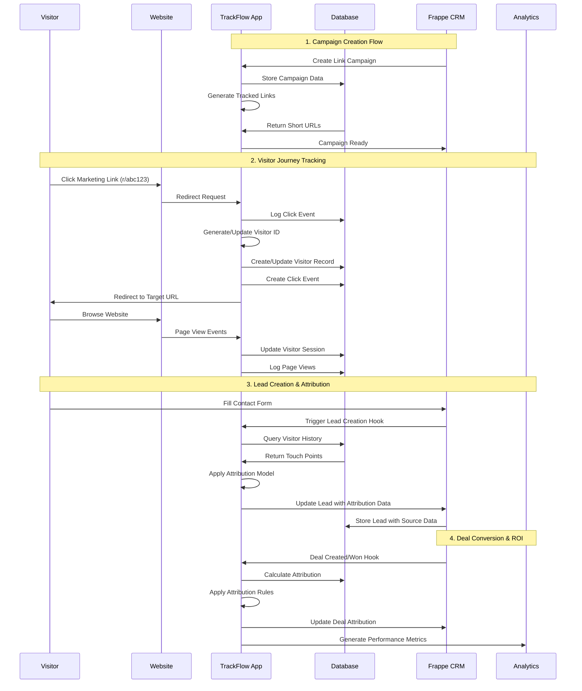
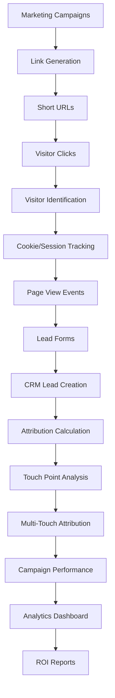
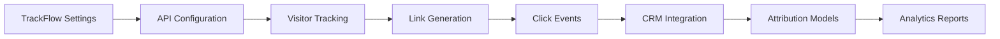

# TrackFlow Architecture & Data Flow

## System Overview
TrackFlow is a marketing attribution platform that integrates with Frappe CRM to track visitor journeys from first touch to conversion.

## Core Components Sequence Diagram

## Data Flow Architecture

## Current Implementation Issues

### 1. TrackFlow Settings Problems
- **Issue**: JavaScript references non-existent fields
- **Root Cause**: Mismatch between DocType JSON schema and JavaScript form handlers
- **Impact**: Internal Server Error when accessing settings

### 2. Attribution Model Integration
- **Issue**: Multiple attribution models defined but integration incomplete
- **Status**: DocType exists but calculation logic needs implementation

### 3. CRM Integration Hooks
- **Issue**: Document event hooks reference methods that may not exist
- **Risk**: Lead creation failures, missing attribution data

### 4. API Endpoint Consistency
- **Issue**: JavaScript calls methods that don't exist in Python files
- **Impact**: Button functions fail, user experience broken

## Critical Path Dependencies

## Fix Priority Matrix

| Component | Priority | Status | Dependencies |
|-----------|----------|---------|--------------|
| TrackFlow Settings | HIGH | 🔴 Broken | None |
| Internal IP Range | HIGH | 🟡 Partial | Settings |
| API Methods | HIGH | 🔴 Missing | Settings |
| Click Tracking | MEDIUM | 🟢 Working | Settings, IP Range |
| CRM Hooks | MEDIUM | 🟡 Untested | API Methods |
| Attribution Models | LOW | 🔴 Not Implemented | CRM Hooks |
| Analytics Reports | LOW | 🟡 Basic | Attribution Models |

## Recommended Fix Sequence

1. **Phase 1: Core Infrastructure**
   - ✅ Fix TrackFlow Settings DocType validation
   - ✅ Add missing API methods
   - ✅ Fix Internal IP Range validation
   - ⏳ Test Settings page functionality

2. **Phase 2: Integration Testing**
   - 🔄 Test CRM document hooks
   - 🔄 Validate link tracking flow
   - 🔄 Test visitor identification

3. **Phase 3: Attribution Engine**
   - ⏳ Implement attribution calculation logic
   - ⏳ Test multi-touch attribution models
   - ⏳ Validate ROI calculations

4. **Phase 4: Analytics & Reporting**
   - ⏳ Test analytics dashboard
   - ⏳ Validate campaign performance reports
   - ⏳ Test visitor journey analysis

## Technical Debt Items

1. **Code Quality**
   - Circular import issues in utils
   - Missing error handling in API endpoints
   - Inconsistent field naming conventions

2. **Database Schema**
   - Missing indexes for performance
   - No data retention policies
   - Foreign key constraints not enforced

3. **Security**
   - API key validation incomplete
   - GDPR compliance features partial
   - IP filtering not fully implemented

## Next Steps

1. Complete TrackFlow Settings stabilization
2. Implement comprehensive testing for each component
3. Add proper error logging and monitoring
4. Create integration test suite for CRM hooks
5. Implement attribution model calculation engine

---

*Generated: $(date)*
*Status: Work in Progress*