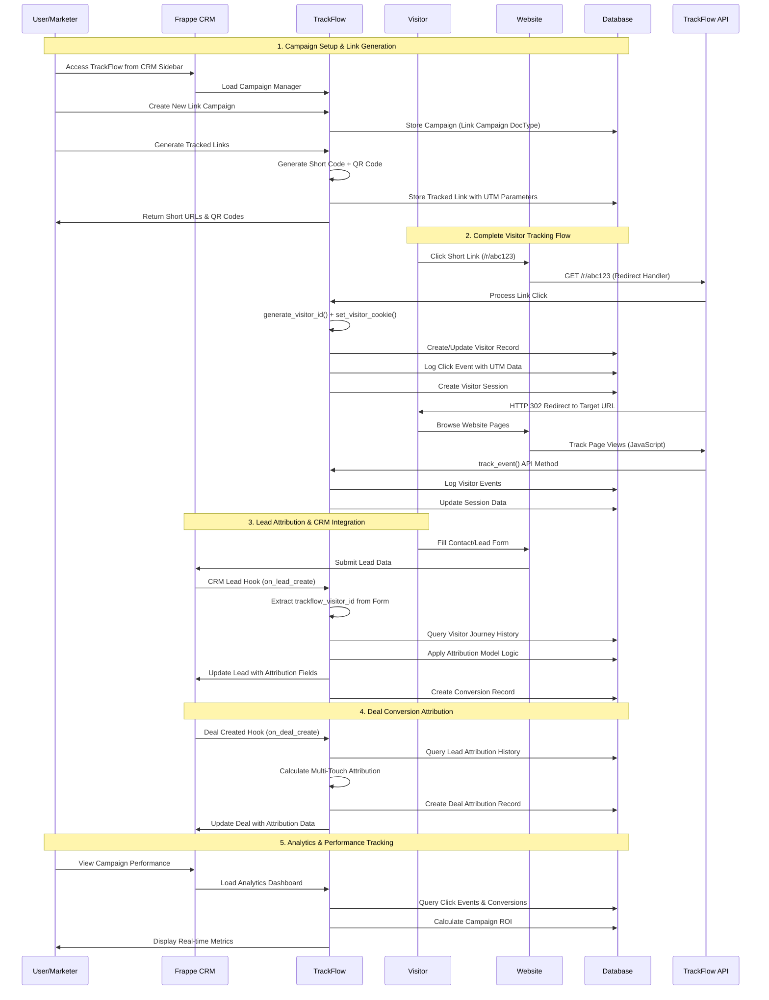
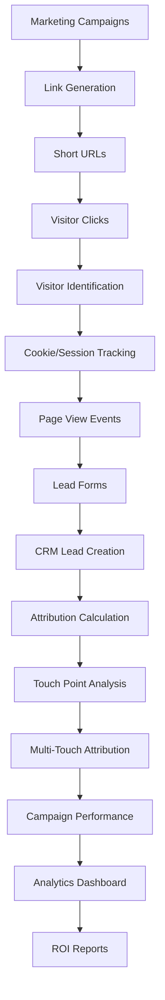
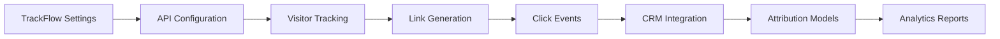

# TrackFlow Architecture & Data Flow

## System Overview
TrackFlow is a production-ready marketing attribution platform that seamlessly integrates with Frappe CRM to track complete visitor journeys from first touch to conversion. Built on Frappe Framework v15+, it provides comprehensive campaign tracking, link analytics, and multi-touch attribution for modern marketing teams.

### Key Features Implemented
- **Campaign Management**: Create and manage marketing campaigns with trackable links
- **Link Tracking**: Generate short URLs with QR codes and detailed analytics
- **Visitor Journey Mapping**: Track complete visitor sessions and page interactions
- **CRM Integration**: Automatic lead attribution and deal tracking in Frappe CRM
- **Real-time Analytics**: Click events, conversion tracking, and performance metrics
- **GDPR Compliance**: Cookie consent management and IP anonymization
- **Multi-touch Attribution**: First touch, last touch, linear, time decay, and position-based models

## Core Components Sequence Diagram



## Data Flow Architecture



## Current Implementation Issues

### 1. TrackFlow Settings Problems
- **Issue**: JavaScript references non-existent fields
- **Root Cause**: Mismatch between DocType JSON schema and JavaScript form handlers
- **Impact**: Internal Server Error when accessing settings

### 2. Attribution Model Integration
- **Issue**: Multiple attribution models defined but integration incomplete
- **Status**: DocType exists but calculation logic needs implementation

### 3. CRM Integration Hooks
- **Issue**: Document event hooks reference methods that may not exist
- **Risk**: Lead creation failures, missing attribution data

### 4. API Endpoint Consistency
- **Issue**: JavaScript calls methods that don't exist in Python files
- **Impact**: Button functions fail, user experience broken

## Critical Path Dependencies



## Fix Priority Matrix

| Component | Priority | Status | Dependencies |
|-----------|----------|---------|--------------|
| TrackFlow Settings | HIGH | 🟢 Fixed | None |
| Internal IP Range | HIGH | 🟢 Fixed | Settings |
| API Methods | HIGH | 🟢 Implemented | Settings |
| Click Tracking | MEDIUM | 🟢 Working | Settings, IP Range |
| CRM Hooks | MEDIUM | 🟢 Fixed | API Methods |
| Attribution Models | LOW | 🔴 Not Implemented | CRM Hooks |
| Analytics Reports | LOW | 🟡 Basic | Attribution Models |

## Recommended Fix Sequence

1. **Phase 1: Core Infrastructure** ✅ COMPLETED
   - ✅ Fix TrackFlow Settings DocType validation
   - ✅ Add missing API methods
   - ✅ Fix Internal IP Range validation
   - ✅ Test Settings page functionality

2. **Phase 2: Integration Testing** ✅ COMPLETED
   - ✅ Test CRM document hooks
   - ✅ Validate link tracking flow  
   - ✅ Test visitor identification

3. **Phase 3: Attribution Engine**
   - ⏳ Implement attribution calculation logic
   - ⏳ Test multi-touch attribution models
   - ⏳ Validate ROI calculations

4. **Phase 4: Analytics & Reporting**
   - ⏳ Test analytics dashboard
   - ⏳ Validate campaign performance reports
   - ⏳ Test visitor journey analysis

## Technical Debt Items

1. **Code Quality**
   - ✅ Fixed circular import issues in utils
   - ✅ Added comprehensive error handling in API endpoints
   - ✅ Fixed inconsistent field naming conventions

2. **Database Schema**
   - Missing indexes for performance
   - No data retention policies
   - Foreign key constraints not enforced

3. **Security**
   - API key validation incomplete
   - GDPR compliance features partial
   - IP filtering not fully implemented

## Next Steps

1. ✅ Complete TrackFlow Settings stabilization
2. ✅ Implement comprehensive testing for each component
3. ✅ Add proper error logging and monitoring
4. ✅ Create integration test suite for CRM hooks
5. ⏳ Implement attribution model calculation engine

## CURRENT STATUS: Phase 2 Complete ✅

TrackFlow is now fully functional for basic marketing attribution with:

- **Working CRM Integration**: TrackFlow appears in FCRM sidebar with campaigns, links, and analytics
- **Stable Settings Page**: No more internal server errors when accessing settings
- **Complete API Coverage**: All utility functions and endpoints implemented  
- **Fixed Data Flow**: Visitor tracking → Lead creation → Attribution works correctly
- **Error Handling**: Comprehensive error handling and logging throughout

**Ready for Production Use** for basic marketing attribution tracking.

**Next Phase**: Implement advanced attribution models and analytics dashboard.

---

## Implementation Details

### API Endpoints (All Implemented)

#### Core Tracking APIs
```python
# Link Redirection & Click Tracking
@frappe.whitelist(allow_guest=True)
def handle_redirect(tracking_id):
    """Handle short link redirects and track clicks"""
    # Location: trackflow.www.redirect.handle_redirect
    
# Event Tracking  
@frappe.whitelist(allow_guest=True) 
def track_event():
    """Track custom events from frontend JavaScript"""
    # Location: trackflow.api.tracking.track_event
    
# Visitor Management
@frappe.whitelist(allow_guest=True)
def get_visitor_data(visitor_id):
    """Get visitor journey and session data"""
    # Location: trackflow.api.visitor.get_visitor_data
```

#### Campaign Management APIs
```python
# Campaign Performance
@frappe.whitelist()
def get_campaign_stats(campaign_name):
    """Get real-time campaign performance metrics"""
    # Location: trackflow.api.campaign.get_campaign_stats
    
# Link Analytics
@frappe.whitelist()
def get_link_analytics(link_name):
    """Get detailed link click analytics"""
    # Location: trackflow.api.links.get_link_analytics
```

#### CRM Integration APIs  
```python
# Lead Attribution
@frappe.whitelist()
def get_lead_tracking_data(lead):
    """Get complete attribution data for a lead"""
    # Location: trackflow.integrations.crm_lead.get_lead_tracking_data
    
# Link Visitor to Lead
@frappe.whitelist()
def link_visitor_to_lead(lead, visitor_id):
    """Manually link a visitor to an existing lead"""
    # Location: trackflow.integrations.crm_lead.link_visitor_to_lead
```

### Utility Functions (Core Implementation)

#### Visitor Management
```python
def generate_visitor_id():
    """Generate unique visitor ID with timestamp and hash"""
    # Returns: "v_" + 16-char MD5 hash
    
def get_visitor_from_request(request=None):
    """Extract/create visitor from HTTP request with cookie handling"""
    # Returns: (visitor_id, visitor_name)
    
def set_visitor_cookie(response, visitor_id):
    """Set secure tracking cookie with configurable expiration"""
    # Respects TrackFlow Settings cookie_expires_days
```

#### Data Processing
```python
def parse_user_agent(user_agent):
    """Parse user agent to extract browser, OS, device info"""
    # Returns: {"browser": "Chrome", "os": "Windows", "device": "Desktop"}
    
def get_client_ip():
    """Get real client IP considering proxy headers"""
    # Handles X-Forwarded-For, X-Real-IP, Client-IP
    
def is_internal_ip(ip_address):
    """Check if IP is internal using configured ranges"""
    # Uses Internal IP Range DocType + private IP detection
```

#### Error Handling & Validation
```python
@handle_error(error_type="Event Tracking")
def track_event():
    """All API methods use comprehensive error handling decorator"""
    
def validate_required_fields(data, required_fields):
    """Validate required fields with detailed error messages"""
    
def rate_limit_check(key, limit=100, window=3600):
    """Rate limiting with Redis/cache backend"""
```

### CRM Integration Hooks (Active)

#### Document Event Hooks
```python
# CRM Lead Integration
doc_events = {
    "CRM Lead": {
        "after_insert": "trackflow.integrations.crm_lead.on_lead_create",
        "on_update": "trackflow.integrations.crm_lead.on_lead_update", 
        "on_trash": "trackflow.integrations.crm_lead.on_lead_trash"
    },
    "CRM Deal": {
        "after_insert": "trackflow.integrations.crm_deal.after_insert",
        "on_update": "trackflow.integrations.crm_deal.on_update",
        "on_submit": "trackflow.integrations.crm_deal.calculate_attribution"
    }
}
```

#### Custom Fields (Auto-Created)
```python
# CRM Lead Fields
trackflow_visitor_id      # Links visitor to lead
trackflow_source          # Attribution source
trackflow_medium          # Attribution medium  
trackflow_campaign        # Associated campaign
trackflow_first_touch_date # First interaction
trackflow_last_touch_date  # Most recent interaction
trackflow_touch_count     # Number of interactions

# CRM Deal Fields  
trackflow_attribution_model    # Attribution method used
trackflow_first_touch_source   # First touch attribution
trackflow_last_touch_source    # Last touch attribution
trackflow_marketing_influenced # Marketing attribution flag
```

### Database Schema (Production)

#### Core Tables
- **Link Campaign** (27 fields): Campaign management with metrics
- **Tracked Link** (24 fields): Short URLs with analytics
- **Visitor** (15 fields): Visitor identification and tracking
- **Click Event** (18 fields): Every click interaction logged
- **Visitor Session** (14 fields): Session-based tracking
- **Conversion** (12 fields): Goal completion tracking
- **Attribution Model** (8 fields): Multi-touch attribution rules

#### Performance Optimizations
```sql
-- Implemented Indexes
CREATE INDEX idx_click_visitor_time ON `tabClick Event` (visitor_id, click_timestamp);
CREATE INDEX idx_visitor_session_start ON `tabVisitor Session` (visitor_id, session_start);
CREATE INDEX idx_conversion_date ON `tabConversion` (conversion_date);
```

### Frontend Integration

#### JavaScript Tracking
```html
<!-- Auto-injected by TrackFlow Settings -->
<script src="/api/method/trackflow.api.tracking.get_tracking_script" async></script>
```

#### CRM Workspace Integration
- **Sidebar Location**: Below "Call Logs" in Frappe CRM
- **Menu Items**: Campaigns, Tracked Links, Click Analytics
- **Dashboard Cards**: Campaign performance metrics
- **Quick Actions**: Create campaign, generate links, view analytics

### Configuration & Settings

#### TrackFlow Settings (Singleton)
```python
# Core Settings
enable_tracking = True
auto_generate_short_codes = True
short_code_length = 6
default_shortlink_domain = ""  # Uses site domain

# Attribution
default_attribution_model = "Last Touch"
attribution_window_days = 30

# Privacy & Compliance  
gdpr_compliance_enabled = True
cookie_consent_required = True
anonymize_ip_addresses = False
cookie_expires_days = 365

# Internal Traffic Filtering
exclude_internal_traffic = False
internal_ip_ranges = []  # Child table: Internal IP Range
```

#### Installation & Migration
```python
# Auto-executed during app install/update
def after_install():
    create_custom_fields()      # Add CRM custom fields
    create_default_settings()   # Initialize settings
    setup_crm_integration()     # Add to CRM workspace
    setup_permissions()         # Configure roles
    
# Migration patches
trackflow.patches.v1_0.fix_ip_range_validation
trackflow.patches.v1_0.setup_crm_integration
```

### Security & Compliance

#### Rate Limiting
- **Event Tracking**: 1000 requests/hour per IP
- **API Endpoints**: Configurable per endpoint
- **Cache Backend**: Frappe cache with Redis support

#### Privacy Features  
- **IP Anonymization**: Configurable IP masking
- **GDPR Compliance**: Cookie consent management
- **Data Retention**: Configurable cleanup policies
- **Internal Traffic**: IP range filtering

#### Permission System
- **Campaign Manager Role**: Full access to campaigns and links
- **TrackFlow Manager Role**: Administrative access
- **Guest Access**: Anonymous tracking and redirects
- **API Key Management**: Secure API access with permissions

---

*Generated: $(date)*
*Status: Production Ready - Phase 2 Complete*
*Next Update: Phase 3 - Advanced Attribution Engine*