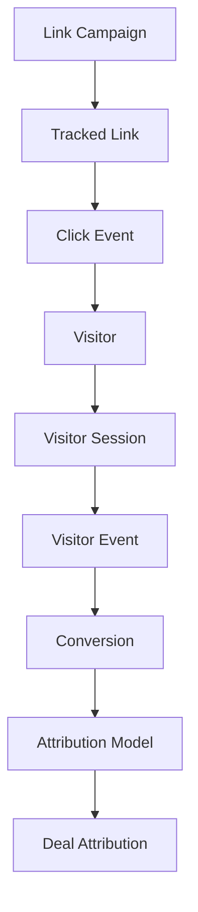

# TrackFlow Database Schema & Entity Relationship Diagram

## Entity Relationship Diagram

```mermaid
erDiagram
    %% Core Campaign Management
    LINK_CAMPAIGN {
        string name PK
        string campaign_id UK
        string campaign_type
        string status
        date start_date
        date end_date
        string owner_user
        text description
        string source
        string medium
        decimal budget
        decimal expected_roi
        int total_clicks
        int unique_visitors
        int conversions
        decimal revenue
        decimal conversion_rate
        decimal cost_per_click
        decimal cost_per_acquisition
        decimal roi_percentage
    }

    TRACKED_LINK {
        string name PK
        string short_code UK
        text destination_url
        text target_url
        string status
        date expiry_date
        text qr_code
        string campaign FK
        string campaign_id
        string source
        string medium
        string content
        string term
        json additional_parameters
        int click_count
        int unique_visitor_count
        int conversion_count
        string created_by
        datetime last_click
    }

    CAMPAIGN_LINK_VARIANT {
        string name PK
        string tracked_link FK
        string variant_name
        text destination_url
        int weight
        boolean active
        int clicks
        int conversions
    }

    %% Visitor Tracking
    VISITOR {
        string visitor_id PK
        datetime first_seen
        datetime last_seen
        int page_views
        string ip_address
        text user_agent
        string source
        string medium
        string campaign
        string term
        string content
        text referrer
        boolean has_converted
        int conversion_count
        date last_conversion_date
        decimal engagement_score
        datetime last_activity
    }

    VISITOR_SESSION {
        string name PK
        string visitor_id FK
        datetime session_start
        datetime session_end
        int page_views
        string entry_page
        string exit_page
        int duration_seconds
        boolean is_bounce
        string source
        string medium
        string campaign
        string device_type
        string browser
        string os
    }

    VISITOR_EVENT {
        string name PK
        string visitor FK
        string session FK
        string tracked_link FK
        string event_type
        datetime timestamp
        text event_data
        text page_url
        text referrer
    }

    %% Click Tracking
    CLICK_EVENT {
        string name PK
        string visitor_id
        string tracked_link FK
        string short_code
        string event_type
        string ip_address
        text user_agent
        string utm_source
        string utm_medium
        string utm_campaign
        string utm_term
        string utm_content
        datetime click_timestamp
        text page_url
        text referrer
        json event_data
        string campaign
    }

    CLICK_QUEUE {
        string name PK
        string visitor_id
        string tracked_link FK
        datetime click_timestamp
        string ip_address
        text user_agent
        json utm_parameters
        text referrer
        string status
        datetime processed_at
        text error_message
    }

    %% Attribution & Conversion
    ATTRIBUTION_MODEL {
        string name PK
        string model_type
        string description
        json custom_rules
        boolean is_active
        decimal position_based_first_weight
        decimal position_based_last_weight
        int time_decay_half_life_days
    }

    ATTRIBUTION_CHANNEL_RULE {
        string name PK
        string parent FK
        string channel_name
        text match_conditions
        int priority
        decimal weight
    }

    CONVERSION {
        string name PK
        string visitor FK
        string tracked_link FK
        string conversion_type
        decimal value
        datetime conversion_date
        string source_campaign
        string source_medium
        string source_source
        json attribution_data
    }

    LINK_CONVERSION {
        string name PK
        string click_event FK
        string tracked_link FK
        string visitor_id
        datetime conversion_date
        string conversion_type
        decimal conversion_value
        json attribution_data
    }

    %% CRM Integration
    DEAL_ATTRIBUTION {
        string name PK
        string deal_id
        string attribution_model FK
        string first_touch_campaign
        string last_touch_campaign
        decimal attribution_value
        json touch_points
        datetime calculation_date
    }

    DEAL_LINK_ASSOCIATION {
        string name PK
        string deal_id
        string tracked_link FK
        string association_type
        datetime created_date
        decimal attribution_weight
    }

    DEAL_STAGE_CHANGE {
        string name PK
        string deal_id
        string from_stage FK
        string to_stage FK
        datetime change_date
        string changed_by FK
        text notes
    }

    LEAD_STATUS_CHANGE {
        string name PK
        string lead_id
        string from_status
        string to_status
        datetime change_date
        string changed_by FK
        string source_campaign
        string source_medium
    }

    %% Configuration & Settings
    TRACKFLOW_SETTINGS {
        string name PK "TrackFlow Settings"
        boolean enable_tracking
        boolean auto_generate_short_codes
        int short_code_length
        string default_shortlink_domain
        boolean exclude_internal_traffic
        boolean gdpr_compliance_enabled
        int cookie_expires_days
        string default_attribution_model
        int attribution_window_days
        json custom_attribution_settings
        boolean cookie_consent_required
        text cookie_consent_text
        string privacy_policy_link
        string cookie_policy_link
        boolean anonymize_ip_addresses
    }

    INTERNAL_IP_RANGE {
        string name PK
        string parent FK
        string ip_range
        string description
    }

    TRACKFLOW_API_KEY {
        string name PK
        string user FK
        string api_key
        boolean is_active
        datetime created_date
        datetime last_used
        int usage_count
    }

    API_KEY_PERMISSION {
        string name PK
        string parent FK
        string permission_type
        json permission_data
    }

    API_KEY_IP_WHITELIST {
        string name PK
        string parent FK
        string ip_address
        string description
    }

    API_KEY_WEBHOOK_EVENT {
        string name PK
        string parent FK
        string event_type
        string webhook_url
        boolean is_active
    }

    API_REQUEST_LOG {
        string name PK
        string api_key FK
        string endpoint
        string method
        datetime request_time
        int response_code
        text request_data
        text response_data
        string ip_address
    }

    %% Templates & Campaigns
    LINK_TEMPLATE {
        string name PK
        string template_name
        text url_template
        text description
        boolean is_active
    }

    TEMPLATE_VARIABLE {
        string name PK
        string parent FK
        string variable_name
        string variable_type
        string default_value
        text description
        json validation_rules
    }

    DOMAIN_CONFIGURATION {
        string name PK
        string domain
        boolean is_primary
        boolean ssl_enabled
        text custom_css
        json tracking_settings
    }

    DOMAIN_HEADER_CONFIGURATION {
        string name PK
        string parent FK
        string header_name
        string header_value
    }

    EMAIL_CAMPAIGN_LOG {
        string name PK
        string campaign FK
        string email_template
        string recipient
        datetime sent_date
        string status
        datetime opened_date
        datetime clicked_date
        string tracked_link FK
    }

    %% Relationships
    LINK_CAMPAIGN ||--o{ TRACKED_LINK : "has many"
    TRACKED_LINK ||--o{ CAMPAIGN_LINK_VARIANT : "has variants"
    TRACKED_LINK ||--o{ CLICK_EVENT : "generates"
    TRACKED_LINK ||--o{ CLICK_QUEUE : "queues"
    TRACKED_LINK ||--o{ VISITOR_EVENT : "tracks"
    TRACKED_LINK ||--o{ LINK_CONVERSION : "converts"
    TRACKED_LINK ||--o{ DEAL_LINK_ASSOCIATION : "associates with deals"
    TRACKED_LINK ||--o{ EMAIL_CAMPAIGN_LOG : "tracks emails"

    VISITOR ||--o{ VISITOR_SESSION : "has sessions"
    VISITOR ||--o{ VISITOR_EVENT : "generates events"
    VISITOR ||--o{ CONVERSION : "converts"
    VISITOR_SESSION ||--o{ VISITOR_EVENT : "contains events"

    CLICK_EVENT ||--o{ LINK_CONVERSION : "can convert"
    
    ATTRIBUTION_MODEL ||--o{ ATTRIBUTION_CHANNEL_RULE : "has rules"
    ATTRIBUTION_MODEL ||--o{ DEAL_ATTRIBUTION : "calculates"

    TRACKFLOW_SETTINGS ||--o{ INTERNAL_IP_RANGE : "defines ranges"

    TRACKFLOW_API_KEY ||--o{ API_KEY_PERMISSION : "has permissions"
    TRACKFLOW_API_KEY ||--o{ API_KEY_IP_WHITELIST : "restricts IPs"
    TRACKFLOW_API_KEY ||--o{ API_KEY_WEBHOOK_EVENT : "triggers webhooks"
    TRACKFLOW_API_KEY ||--o{ API_REQUEST_LOG : "logs requests"

    LINK_TEMPLATE ||--o{ TEMPLATE_VARIABLE : "has variables"
    DOMAIN_CONFIGURATION ||--o{ DOMAIN_HEADER_CONFIGURATION : "has headers"
```



## Key Relationships & Data Flow

### 1. Campaign → Link → Click → Attribution Flow



### 2. Foreign Key Relationships

| Child Table | Parent Table | Relationship Type | Foreign Key |
|-------------|--------------|-------------------|-------------|
| Tracked Link | Link Campaign | Many-to-One | campaign |
| Click Event | Tracked Link | Many-to-One | tracked_link |
| Click Event | Visitor | Many-to-One | visitor_id |
| Visitor Session | Visitor | Many-to-One | visitor_id |
| Visitor Event | Visitor | Many-to-One | visitor |
| Visitor Event | Visitor Session | Many-to-One | session |
| Visitor Event | Tracked Link | Many-to-One | tracked_link |
| Conversion | Visitor | Many-to-One | visitor |
| Conversion | Tracked Link | Many-to-One | tracked_link |
| Link Conversion | Click Event | Many-to-One | click_event |
| Link Conversion | Tracked Link | Many-to-One | tracked_link |
| Deal Attribution | Attribution Model | Many-to-One | attribution_model |
| Internal IP Range | TrackFlow Settings | Many-to-One | parent |
| API Key Permission | TrackFlow API Key | Many-to-One | parent |

### 3. Core Data Types & Constraints

#### Primary Keys
- Most tables use auto-generated hash or field-based naming
- `Link Campaign` uses `campaign_name` as primary key
- `Visitor` uses `visitor_id` as primary key
- `TrackFlow Settings` is a singleton document

#### Unique Constraints
- `Tracked Link.short_code` must be unique
- `Link Campaign.campaign_name` must be unique
- `Visitor.visitor_id` must be unique

#### Required Fields
- All primary relationships (visitor_id, tracked_link, etc.)
- Timestamps (click_timestamp, session_start, etc.)
- Core identification fields (campaign_name, short_code, etc.)

### 4. Indexes Recommended for Performance

```sql
-- Click tracking performance
CREATE INDEX idx_click_event_visitor_timestamp ON `tabClick Event` (visitor_id, click_timestamp);
CREATE INDEX idx_click_event_tracked_link ON `tabClick Event` (tracked_link);
CREATE INDEX idx_click_event_campaign ON `tabClick Event` (campaign, click_timestamp);

-- Visitor analysis
CREATE INDEX idx_visitor_session_visitor_start ON `tabVisitor Session` (visitor_id, session_start);
CREATE INDEX idx_visitor_event_visitor_timestamp ON `tabVisitor Event` (visitor, timestamp);

-- Attribution queries
CREATE INDEX idx_conversion_visitor_date ON `tabConversion` (visitor, conversion_date);
CREATE INDEX idx_deal_attribution_deal ON `tabDeal Attribution` (deal_id);

-- API performance
CREATE INDEX idx_api_request_log_key_time ON `tabAPI Request Log` (api_key, request_time);
```

### 5. Data Retention & Cleanup

| Table | Retention Period | Cleanup Strategy |
|-------|------------------|------------------|
| Click Event | 2 years | Archive old events |
| Visitor Event | 1 year | Delete non-converting visitors |
| Click Queue | 7 days | Clear processed items |
| API Request Log | 90 days | Rotate logs |
| Visitor Session | 1 year | Archive inactive visitors |

### 6. Critical Relationships for Attribution

The attribution engine relies on these key relationships:

1. **Visitor Journey**: `Visitor` → `Visitor Session` → `Visitor Event`
2. **Campaign Attribution**: `Link Campaign` → `Tracked Link` → `Click Event` → `Conversion`
3. **CRM Integration**: `Deal Attribution` ← `Attribution Model` → `Conversion`
4. **Multi-Touch**: Multiple `Click Event` records per `Visitor` for attribution calculation

---

*Generated: $(date)*
*Schema Version: 1.0*
*Total Tables: 27*