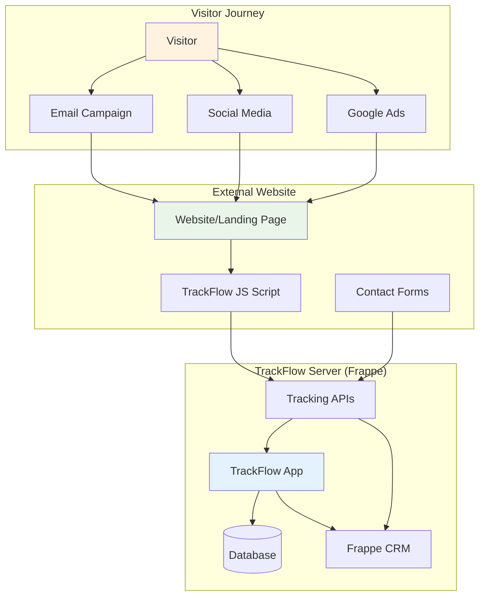

# TrackFlow External Site Tracking Guide

## Overview

TrackFlow can track **any external website** by embedding a JavaScript tracking script. This allows you to run TrackFlow on your Frappe/CRM server while tracking visitors on separate marketing websites, e-commerce sites, or landing pages.

## Architecture: TrackFlow Server + External Website



---

## Setup Process

### Step 1: Configure TrackFlow Server

#### 1.1 Install TrackFlow on Frappe Server
```bash
# On your Frappe/CRM server
cd frappe-bench
bench get-app https://github.com/chinmaybhatk/trackflow.git
bench install-app trackflow --site your-crm-site.com
```

#### 1.2 Configure Cross-Domain Settings
```python
# Access TrackFlow Settings in your CRM
# Go to: https://your-crm-site.com/app/trackflow-settings

settings = frappe.get_single("TrackFlow Settings")
settings.enable_tracking = 1
settings.enable_cross_domain_tracking = 1

# Add domains you want to track
settings.append("allowed_domains", {
    "domain": "yourcompany.com",
    "description": "Main marketing website"
})
settings.append("allowed_domains", {
    "domain": "shop.yourcompany.com", 
    "description": "E-commerce store"
})
settings.append("allowed_domains", {
    "domain": "landing.yourcompany.com",
    "description": "Landing pages"
})

settings.save()
```

#### 1.3 Generate Tracking Pixel & Script URLs
```python
# Your tracking endpoints will be:
tracking_script = "https://your-crm-site.com/api/method/trackflow.api.tracking.get_tracking_script"
tracking_pixel = "https://your-crm-site.com/api/method/trackflow.api.tracking.track_pixel"
event_endpoint = "https://your-crm-site.com/api/method/trackflow.api.tracking.track_event"
redirect_base = "https://your-crm-site.com/r/"
```

### Step 2: Create Campaigns & Links

#### 2.1 Create Campaign in TrackFlow
```python
# In your CRM: TrackFlow → Campaigns → New
campaign = frappe.new_doc("Link Campaign")
campaign.campaign_name = "External Site Email Campaign"
campaign.campaign_type = "Email Marketing"
campaign.source = "email"
campaign.medium = "newsletter" 
campaign.target_domain = "yourcompany.com"  # External site
campaign.insert()
```

#### 2.2 Generate Tracked Links
```python
# Create tracked links pointing to external site
link = frappe.new_doc("Tracked Link")
link.title = "Homepage CTA"
link.destination_url = "https://yourcompany.com/products?utm_source=email&utm_medium=newsletter"
link.campaign = campaign.name
link.insert()

# Result: https://your-crm-site.com/r/abc123
# Redirects to: https://yourcompany.com/products with tracking
```

### Step 3: Embed Tracking on External Website

#### 3.1 Add TrackFlow Script to Website Headers
```html
<!-- Add to <head> section of yourcompany.com -->
<!DOCTYPE html>
<html>
<head>
    <title>Your Company</title>
    
    <!-- TrackFlow Cross-Domain Tracking -->
    <script>
        (function(t,r,a,c,k,f,l,o,w) {
            t['TrackFlowObject'] = k;
            t[k] = t[k] || function() { (t[k].q = t[k].q || []).push(arguments) };
            f = r.createElement(a), l = r.getElementsByTagName(a)[0];
            f.async = 1; f.src = c; l.parentNode.insertBefore(f, l);
        })(window, document, 'script', 'https://your-crm-site.com/api/method/trackflow.api.tracking.get_tracking_script', 'trackflow');
        
        // Configure TrackFlow
        trackflow('config', {
            server_url: 'https://your-crm-site.com',
            site_domain: 'yourcompany.com',
            enable_page_tracking: true,
            enable_form_tracking: true,
            cookie_domain: '.yourcompany.com'  // For subdomain tracking
        });
        
        // Track page view
        trackflow('page_view');
    </script>
</head>
```

#### 3.2 Track Form Submissions
```html
<!-- Contact form on yourcompany.com -->
<form id="contact-form" action="/submit-lead" method="POST">
    <input type="text" name="name" placeholder="Name" required>
    <input type="email" name="email" placeholder="Email" required>
    <input type="text" name="company" placeholder="Company">
    
    <!-- Hidden fields for tracking -->
    <input type="hidden" name="trackflow_visitor_id" id="tf-visitor">
    <input type="hidden" name="trackflow_source" id="tf-source">
    <input type="hidden" name="trackflow_medium" id="tf-medium">
    <input type="hidden" name="trackflow_campaign" id="tf-campaign">
    
    <button type="submit">Submit</button>
</form>

<script>
// Auto-populate tracking fields
document.addEventListener('DOMContentLoaded', function() {
    const visitorData = trackflow('get_visitor_data');
    
    document.getElementById('tf-visitor').value = visitorData.visitor_id;
    document.getElementById('tf-source').value = visitorData.source || '';
    document.getElementById('tf-medium').value = visitorData.medium || '';
    document.getElementById('tf-campaign').value = visitorData.campaign || '';
});

// Track form submission
document.getElementById('contact-form').addEventListener('submit', function(e) {
    trackflow('track_event', {
        event_type: 'form_submit',
        form_name: 'contact_form',
        page_url: window.location.href
    });
    
    // Optional: Send lead data directly to TrackFlow/CRM
    const formData = new FormData(this);
    fetch('https://your-crm-site.com/api/method/trackflow.api.leads.create_external_lead', {
        method: 'POST',
        body: formData,
        credentials: 'include'
    });
});
</script>
```

#### 3.3 Track Custom Events
```javascript
// E-commerce tracking
trackflow('track_event', {
    event_type: 'product_view',
    product_id: 'PROD-123',
    product_name: 'Premium Widget',
    category: 'widgets',
    price: 99.99
});

// Conversion tracking
trackflow('track_event', {
    event_type: 'purchase',
    transaction_id: 'TXN-456',
    value: 299.97,
    items: [
        {id: 'PROD-123', name: 'Premium Widget', price: 99.99, qty: 3}
    ]
});

// Custom goal tracking
trackflow('track_event', {
    event_type: 'goal_complete',
    goal_name: 'newsletter_signup',
    value: 10  // Lead value
});
```

### Step 4: Configure Lead Integration

#### 4.1 Create External Lead Endpoint
```python
# Add to TrackFlow API (trackflow/api/leads.py)
@frappe.whitelist(allow_guest=True)
def create_external_lead():
    """Create CRM lead from external website form submission"""
    
    # Extract form data
    data = frappe.local.form_dict
    
    # Validate required fields
    if not data.get('email'):
        return {"status": "error", "message": "Email is required"}
    
    # Get visitor tracking data
    visitor_id = data.get('trackflow_visitor_id')
    visitor_data = {}
    
    if visitor_id:
        visitor = frappe.db.get_value("Visitor", 
                                    {"visitor_id": visitor_id}, 
                                    ["source", "medium", "campaign", "first_seen"], 
                                    as_dict=True)
        if visitor:
            visitor_data = visitor
    
    # Create CRM Lead
    lead = frappe.new_doc("CRM Lead")
    lead.email = data.get('email')
    lead.lead_name = data.get('name', data.get('email'))
    lead.company_name = data.get('company', '')
    lead.phone = data.get('phone', '')
    lead.source = visitor_data.get('source') or data.get('trackflow_source') or 'Website'
    
    # Add TrackFlow attribution fields
    lead.trackflow_visitor_id = visitor_id
    lead.trackflow_source = visitor_data.get('source') or data.get('trackflow_source')
    lead.trackflow_medium = visitor_data.get('medium') or data.get('trackflow_medium')  
    lead.trackflow_campaign = visitor_data.get('campaign') or data.get('trackflow_campaign')
    lead.trackflow_first_touch_date = visitor_data.get('first_seen')
    lead.trackflow_last_touch_date = frappe.utils.now()
    
    try:
        lead.insert(ignore_permissions=True)
        
        # Track conversion
        if visitor_id:
            create_conversion_record(lead, visitor_id, "external_lead_created")
        
        return {
            "status": "success", 
            "lead_id": lead.name,
            "message": "Lead created successfully"
        }
        
    except Exception as e:
        frappe.log_error(f"External lead creation failed: {str(e)}")
        return {"status": "error", "message": "Failed to create lead"}

def create_conversion_record(lead, visitor_id, conversion_type):
    """Create conversion record for external lead"""
    try:
        visitor_name = frappe.db.get_value("Visitor", {"visitor_id": visitor_id}, "name")
        
        if visitor_name:
            conversion = frappe.new_doc("Conversion")
            conversion.visitor = visitor_name
            conversion.conversion_type = conversion_type
            conversion.conversion_date = frappe.utils.now()
            conversion.source = lead.trackflow_source
            conversion.medium = lead.trackflow_medium
            conversion.campaign = lead.trackflow_campaign
            conversion.metadata = frappe.as_json({
                "lead_id": lead.name,
                "lead_email": lead.email,
                "external_site": True
            })
            conversion.insert(ignore_permissions=True)
            
    except Exception as e:
        frappe.log_error(f"Conversion record creation failed: {str(e)}")
```

#### 4.2 Server-Side Form Handler (Alternative)

If your external website can't make API calls, process forms server-side:

```python
# On your external website server (PHP/Node.js/Python)
import requests
import json

def handle_contact_form_submission(form_data):
    # Process form locally first
    save_lead_to_local_db(form_data)
    
    # Send to TrackFlow/CRM
    trackflow_data = {
        'email': form_data['email'],
        'name': form_data['name'],
        'company': form_data['company'],
        'phone': form_data.get('phone', ''),
        'trackflow_visitor_id': form_data.get('trackflow_visitor_id'),
        'trackflow_source': form_data.get('trackflow_source'),
        'trackflow_medium': form_data.get('trackflow_medium'),
        'trackflow_campaign': form_data.get('trackflow_campaign'),
    }
    
    response = requests.post(
        'https://your-crm-site.com/api/method/trackflow.api.leads.create_external_lead',
        data=trackflow_data,
        headers={'Content-Type': 'application/x-www-form-urlencoded'}
    )
    
    return response.json()
```

---

## Multi-Domain Configuration

### Tracking Across Subdomains

#### Configure Cookie Domain
```javascript
// For tracking across *.yourcompany.com
trackflow('config', {
    server_url: 'https://your-crm-site.com',
    cookie_domain: '.yourcompany.com',  // Includes www, shop, blog, etc.
    enable_subdomain_tracking: true
});
```

#### Cross-Subdomain Link Tracking
```python
# Generate links that work across subdomains
link = frappe.new_doc("Tracked Link") 
link.title = "Shop CTA"
link.destination_url = "https://shop.yourcompany.com/products"
link.preserve_subdomain = True  # Maintains visitor session
link.campaign = "email_to_shop"
link.insert()
```

### Tracking Multiple Domains

#### Server Configuration
```python
# TrackFlow Settings
settings = frappe.get_single("TrackFlow Settings")

# Add all domains you want to track
domains = [
    "yourcompany.com",
    "yourstore.com", 
    "yourblog.net",
    "landingpage.io"
]

for domain in domains:
    settings.append("allowed_domains", {
        "domain": domain,
        "description": f"Marketing site: {domain}"
    })
    
settings.save()
```

#### Cross-Domain Link Tracking
```javascript
// Link visitors across different domains
function trackCrossDomainClick(url, campaign) {
    const visitorId = trackflow('get_visitor_id');
    const crossDomainUrl = `${url}?_tf_vid=${visitorId}&_tf_campaign=${campaign}`;
    
    trackflow('track_event', {
        event_type: 'cross_domain_click',
        target_domain: new URL(url).hostname,
        campaign: campaign
    });
    
    window.location.href = crossDomainUrl;
}

// On destination domain, restore visitor session
document.addEventListener('DOMContentLoaded', function() {
    const urlParams = new URLSearchParams(window.location.search);
    const visitorId = urlParams.get('_tf_vid');
    const campaign = urlParams.get('_tf_campaign');
    
    if (visitorId) {
        trackflow('restore_visitor_session', {
            visitor_id: visitorId,
            campaign: campaign,
            referrer_domain: document.referrer
        });
    }
});
```

---

## WordPress Integration Example

### TrackFlow WordPress Plugin Structure
```php
<?php
/**
 * Plugin Name: TrackFlow Integration
 * Description: Integrate WordPress with TrackFlow marketing attribution
 * Version: 1.0.0
 */

class TrackFlowWP {
    private $trackflow_server = 'https://your-crm-site.com';
    private $site_domain = 'yourwordpresssite.com';
    
    public function __construct() {
        add_action('wp_head', array($this, 'inject_tracking_script'));
        add_action('wp_footer', array($this, 'track_page_view'));
        add_action('wpcf7_mail_sent', array($this, 'track_form_submission')); // Contact Form 7
        add_action('gform_after_submission', array($this, 'track_gravity_form')); // Gravity Forms
    }
    
    public function inject_tracking_script() {
        ?>
        <script>
        (function(t,r,a,c,k,f,l,o,w) {
            t['TrackFlowObject'] = k;
            t[k] = t[k] || function() { (t[k].q = t[k].q || []).push(arguments) };
            f = r.createElement(a), l = r.getElementsByTagName(a)[0];
            f.async = 1; f.src = c; l.parentNode.insertBefore(f, l);
        })(window, document, 'script', '<?php echo $this->trackflow_server; ?>/api/method/trackflow.api.tracking.get_tracking_script', 'trackflow');
        
        trackflow('config', {
            server_url: '<?php echo $this->trackflow_server; ?>',
            site_domain: '<?php echo $this->site_domain; ?>',
            enable_page_tracking: true,
            enable_form_tracking: true
        });
        </script>
        <?php
    }
    
    public function track_page_view() {
        ?>
        <script>
        trackflow('page_view', {
            post_type: '<?php echo get_post_type(); ?>',
            post_id: '<?php echo get_the_ID(); ?>',
            categories: <?php echo json_encode(wp_get_post_categories(get_the_ID(), array('fields' => 'names'))); ?>
        });
        </script>
        <?php
    }
    
    public function track_form_submission($contact_form) {
        $visitor_id = $_COOKIE['trackflow_visitor_id'] ?? null;
        
        if ($visitor_id) {
            $submission = WPCF7_Submission::get_instance();
            $posted_data = $submission->get_posted_data();
            
            $this->send_lead_to_trackflow(array(
                'email' => $posted_data['your-email'],
                'name' => $posted_data['your-name'], 
                'message' => $posted_data['your-message'],
                'trackflow_visitor_id' => $visitor_id,
                'form_name' => $contact_form->name(),
                'page_url' => $_SERVER['HTTP_REFERER']
            ));
        }
    }
    
    private function send_lead_to_trackflow($data) {
        wp_remote_post($this->trackflow_server . '/api/method/trackflow.api.leads.create_external_lead', array(
            'method' => 'POST',
            'body' => $data,
            'timeout' => 10
        ));
    }
}

new TrackFlowWP();
?>
```

---

## Testing & Debugging

### Test Cross-Domain Tracking

#### 1. Verify Script Loading
```javascript
// Check in browser console on your external site
console.log(typeof trackflow); // Should be "function"
console.log(trackflow('get_visitor_id')); // Should return visitor ID
```

#### 2. Test Event Tracking
```javascript
// Send test event
trackflow('track_event', {
    event_type: 'test_event',
    test_data: 'cross_domain_test'
});

// Check network tab for POST to your-crm-site.com/api/method/trackflow.api.tracking.track_event
```

#### 3. Verify Lead Creation
```python
# In your TrackFlow/CRM system
# Check if external leads are being created
external_leads = frappe.get_all("CRM Lead", 
                               filters={"trackflow_visitor_id": ["is", "set"]}, 
                               fields=["name", "email", "trackflow_source", "creation"])
print(external_leads)
```

### Debug Common Issues

#### CORS Issues
```python
# Add to TrackFlow hooks.py if getting CORS errors
before_request = [
    "trackflow.www.redirect.before_request",
    "trackflow.api.cors.handle_cors"
]

# Create trackflow/api/cors.py
def handle_cors():
    import frappe
    if frappe.request.method == "OPTIONS":
        frappe.local.response.headers["Access-Control-Allow-Origin"] = "*"
        frappe.local.response.headers["Access-Control-Allow-Methods"] = "GET, POST, OPTIONS"
        frappe.local.response.headers["Access-Control-Allow-Headers"] = "Content-Type"
        frappe.respond_as_web_page("", "")
```

#### Cookie Issues
```javascript
// Debug cookie setting
trackflow('debug', {
    show_cookies: true,
    log_events: true
});

// Check if cookies are being set across domains
console.log(document.cookie.split(';').filter(c => c.includes('trackflow')));
```

---

*External Site Tracking Guide*
*Version: 1.0*
*Compatible with TrackFlow 2.0+*